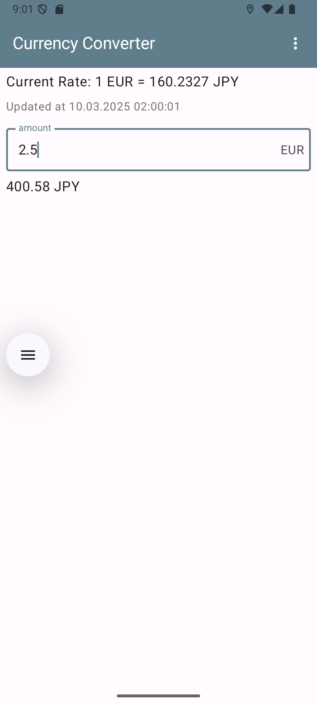
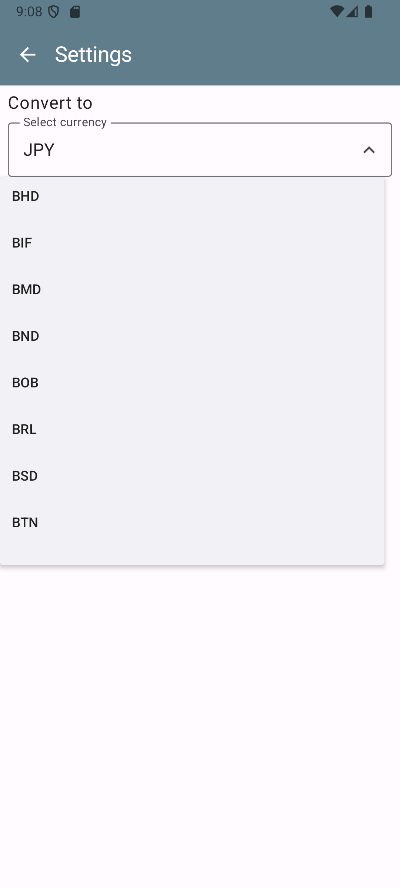

# 📱 Currency Converter App (Android)

## 🚀 Overview

**Currency Converter App** is an Android application built with Kotlin. It is designed to help users convert euro to the selected target currency with the latest rate.

## 🎯 Features

✅ Intuitive and modern UI (Material Design 3)  
✅ MVVM architecture for maintainability  
✅ Jetpack Compose for declarative UI   
✅ Retrofit for API integration   
 

## 📸 Screenshots

| Home Screen | Settings |
|------------|---------|
|  |  |

## 🛠️ Tech Stack

- **Language**: Kotlin
- **UI Framework**: Jetpack Compose
- **Architecture**: MVVM
- **Networking**: Retrofit

## 🔧 Installation

1. Clone the repository:
   ```sh
   git clone https://github.com/t3mina00/Currency-Converter-Kotlin.git
   ```
2. Open in **Android Studio**.
3. Sync Gradle and build the project.
4. Get API key of [ExchangeRate-API](https://www.exchangerate-api.com/) and set it to `/local.properties` as `API_KEY=`.
5. Run the app on an emulator or a real device.

## 📂 Project Structure

```
app/
├── src/
│   ├── main/
│   │   ├── java/com/example/currencyconverter/
│   │   │   ├── model/       
│   │   │   ├── ui/         
│   │   │   ├── viewmodel/     
│   │   │   ├── MainActivity.kt
│   │   ├── res/           
│   ├── test/                    
```

## 🚀 Future Enhancements

- Implement the feature to call API and update rates manually
- Implement the feature to select the region (currently it is hardcoded as 'Europe/Helsinki')
- Implement the feature to select the base currency (currently it is fixed to EUR)


